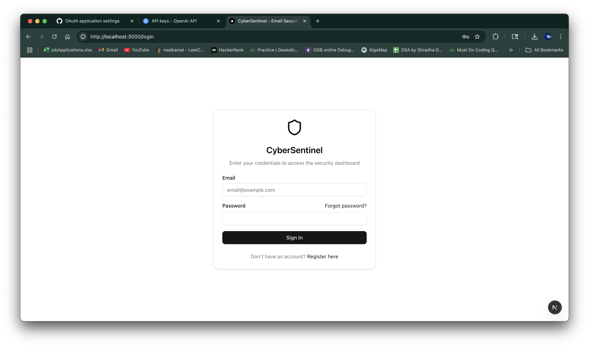
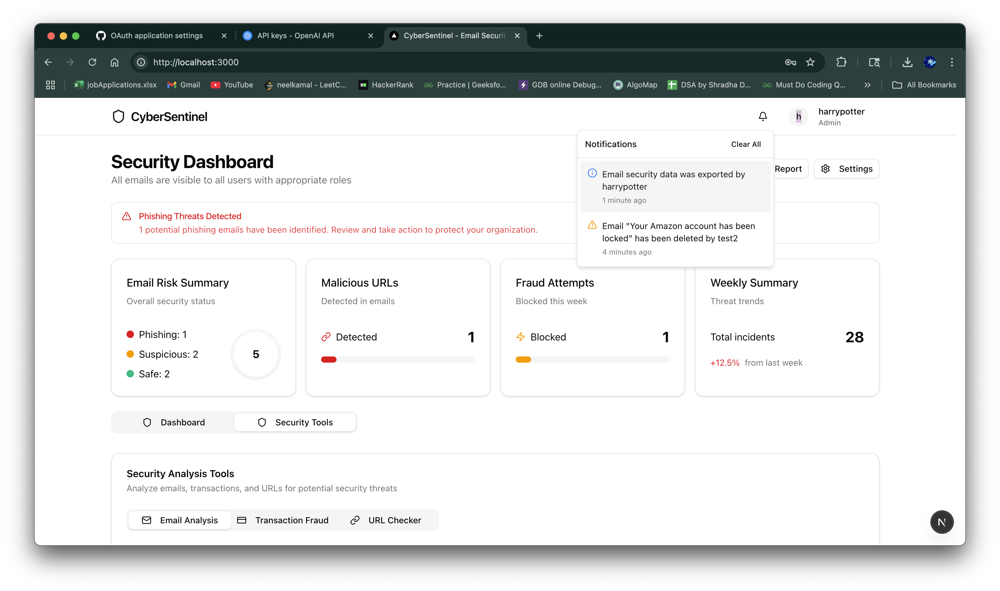
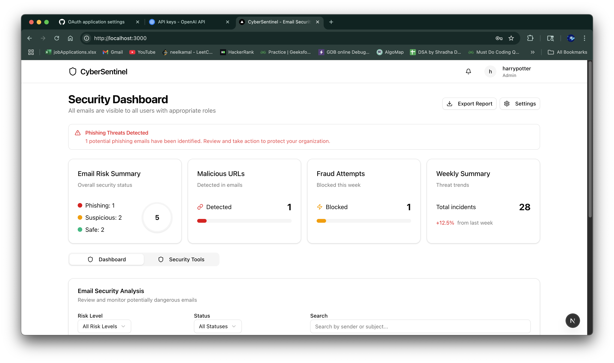

<p align="center">
  
</p>

<h1 align="center">CyberSentinel</h1>

<p align="center">
  <em>AI-Powered Cybersecurity Platform — detect phishing, fraud, and malicious activity in real time.</em>
</p>

---

## 🚀 Overview

**CyberSentinel** is a **full-stack AI-driven cybersecurity platform** built to analyze emails, transactions, and URLs for threats in real time.  
The system integrates **NLP and ML models** like **BERT** and **Random Forests** to identify phishing attempts, fraudulent behavior, and suspicious links.  
The platform provides a **modern dashboard**, **secure API services**, and is built with **cloud-native scalability** in mind.

---

## 📸 Screenshots

<p align="center">
  
   
  
  
</p>

---

## ✨ Core Features

- **Phishing Detection via BERT:** Uses NLP to analyze email content and classify phishing attempts.
- **Fraud Detection Engine:** Utilizes Random Forest classifiers to flag suspicious financial activity.
- **Threat Dashboard:** Interactive frontend for monitoring flagged threats, model output, and history.
- **JWT-Based Auth:** Secure authentication with role-based access control.
- **Microservice Architecture:** Modular deployment for frontend, backend, and ML services.
- **Scalable Cloud Deployment:** Containerized with Docker and hosted on AWS with monitoring enabled.

---

## 🛠️ Tech Stack

- **Frontend:** React.js, Tailwind CSS  
- **Backend:** Flask, Python  
- **Machine Learning:** BERT (NLP), Random Forest (Sklearn)  
- **Database:** MongoDB  
- **Deployment:** AWS EC2, Docker, NGINX, AWS CloudWatch  

---

## ⚡ Getting Started

To set up CyberSentinel locally:

### 1. Clone the repository
```bash
git clone https://github.com/neelkamalrana/CyberSentinel.git
cd CyberSentinel/cybersentinel
```

### 2. Install dependencies
```bash
npm install
```

### 3. Set up environment variables
Create a `.env.local` file in the `cybersentinel` directory with the following variables:
```
GITHUB_ID=your_github_client_id
GITHUB_SECRET=your_github_client_secret
NEXTAUTH_URL=http://localhost:3000
```
### 4. Run the development server
```bash
npm run dev
```
<h2>
  <a href="https://github.com/neelkamalrana/CyberSentinel/wiki"> Click to check wiki page...</a>
</h2>
